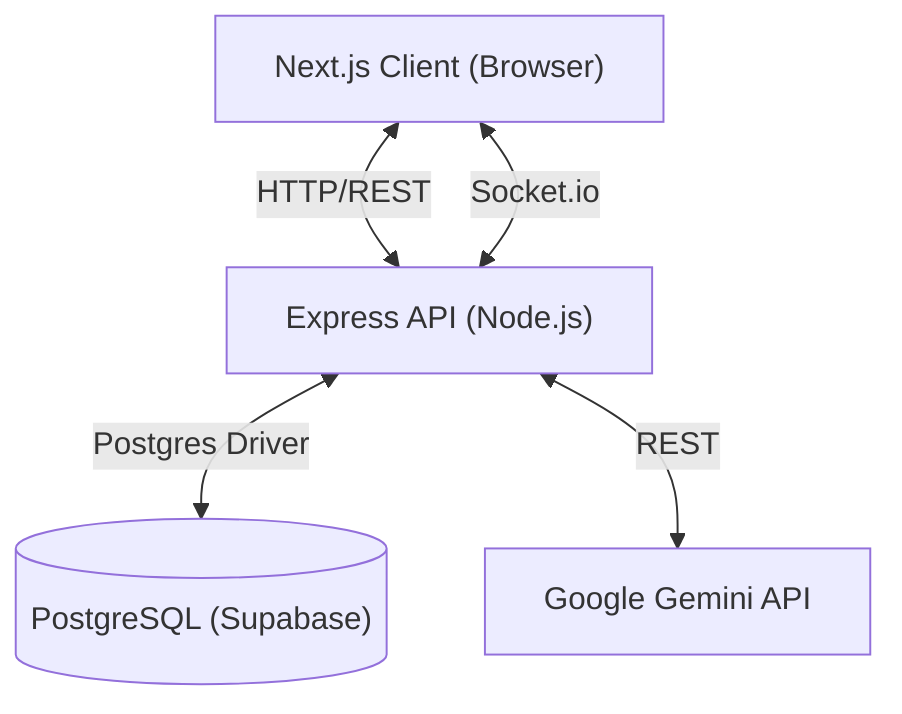
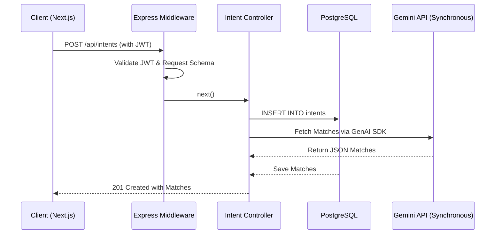

# Tech Stack Reasoning & Architectural Decisions

When an interviewer asks, **"Why did you choose this specific tech stack?"** they are testing if you just followed a tutorial or if you actually weighed the trade-offs of different technologies. 

Below is the detailed, professional reasoning for every major technology choice in Collixa.

---

## 1. Frontend: Next.js 14 (App Router) & React
**Question: Why Next.js over a standard React Single Page Application (SPA) (like Vite or Create React App)?**

**Detailed Reasoning:**
*   **SEO and Discoverability:** Collixa is a marketplace where 'Intents' (projects) need to be discoverable via search engines. A standard React SPA renders an empty `
` and fetches data client-side, which hurts SEO. Next.js provides Server-Side Rendering (SSR), meaning search engine crawlers instantly see the fully rendered HTML of public project postings.
*   **Performance (First Contentful Paint):** By rendering on the server, Next.js significantly reduces the First Contentful Paint (FCP) time compared to an SPA, making the site feel much faster on initial load, which is critical for user retention.
*   **App Router Paradigm:** Next.js 14's App Router allows for nested layouts and React Server Components (RSC). This allows me to ship zero JavaScript to the client for purely static UI components, drastically reducing the bundle size.

## 2. Styling & UX: Tailwind CSS + Framer Motion
**Question: Why Tailwind instead of standard CSS or Styled Components? Why Framer Motion?**

**Detailed Reasoning:**
*   **Tailwind (Velocity & Consistency):** Tailwind provides a utility-first approach that allowed me to build the UI significantly faster without constantly context-switching between JSX and CSS files. More importantly, it enforces a strict design system (spacing, colors, typography), preventing the CSS bloat that usually happens in large projects.
*   **Framer Motion (Premium UX):** A marketplace needs to build trust. A UI with harsh transitions feels cheap, while a UI with micro-interactions and smooth transitions feels premium. Framer Motion is the industry standard for declarative animations in React, allowing me to easily implement glassmorphism effects, page transitions, and interactive feedback without writing complex CSS keyframes.

## 3. Backend API: Node.js & Express.js
**Question: If you are using Next.js, why do you have a separate Express server? Why not just use Next.js API Routes?**

**Detailed Reasoning:**
*   **The Limitation of Serverless:** Next.js API routes are fundamentally designed to be serverless (stateless, short-lived functions). However, Collixa requires persistent, stateful connections for real-time chat (WebSockets). Serverless functions cannot natively hold WebSocket connections open continuously.
*   **Decoupling for the Future:** By maintaining a standalone Express backend, I completely decoupled the API from the web client. If we ever want to build an iOS/Android app using React Native, the mobile app can consume the exact same Express API without being tied to the Next.js web ecosystem.
*   **Ecosystem & Middleware:** Express has the most mature middleware ecosystem in Node.js, making it incredibly straightforward to implement custom JWT authentication, error handling, and robust CORS policies.

## 4. Real-time Communication: Socket.io
**Question: Why Socket.io instead of native WebSockets or Server-Sent Events (SSE)?**

**Detailed Reasoning:**
*   **Resilience:** Native WebSockets require you to manually handle reconnections, ping/pong heartbeats, and fallbacks. Socket.io handles all of this out of the box. If a user's network drops on mobile, Socket.io automatically attempts to reconnect.
*   **Rooms & Namespaces:** Collixa relies heavily on 'Tribes' (teams). Socket.io has a built-in concept of "Rooms", making it trivial to isolate chat messages so that an event emitted in Tribe A's room is never accidentally broadcasted to Tribe B.

## 5. Database: PostgreSQL (via Supabase)
**Question: Why a Relational Database (PostgreSQL) instead of NoSQL (like MongoDB)?**

**Detailed Reasoning:**
*   **Highly Relational Data:** Collixa's data model is fundamentally relational. Users create and own Intents, Users also independently join and form Tribes (skill-sharing groups), Tribes have many Members, and Users have a ledger of Credits.
*   **Data Integrity:** With a simulated financial ledger, data integrity is critical. PostgreSQL provides strict type safety and Foreign Key Constraints (for example, using `ON DELETE CASCADE` so if a User is deleted, all of their related Intents and Tribe memberships are cleanly wiped to prevent orphaned data). While our MVP currently handles ledger updates sequentially in the Node.js backend, a relational database gives us the future capability to implement row-level locking for advanced race condition prevention.
*   **Why Supabase?** I chose Supabase to host the PostgreSQL database because it acts as an excellent Backend-as-a-Service (BaaS). It provided the database, connection pooling, and AWS S3-backed file storage out of the box, drastically reducing DevOps overhead for an MVP while keeping the core database standard open-source PostgreSQL.

## 6. Artificial Intelligence: Google Gemini Flash
**Question: Why Gemini Flash over OpenAI's GPT-4 or Anthropic's Claude?**

**Detailed Reasoning:**
*   **Speed vs. Complexity:** The matching engine needs to analyze profiles quickly. Gemini *Flash* is explicitly designed by Google for low-latency, high-frequency reasoning tasks. Since I am enforcing a strict JSON schema output, I didn't need the heavy reasoning capabilities of a massive, slower model like GPT-4; I needed speed and structural compliance.
*   **Rate Limits & Fallbacks:** By choosing a fast, lighter model, the API is less likely to timeout. However, as demonstrated in the 'Graceful Degradation' architecture, I specifically designed the system not to rely entirely on the provider, ensuring the marketplace functions even if Gemini hits rate limits.

---

# Architecture & System Design - Complete Interview Preparation

This document covers all probable architectural and system design questions that could be asked in an interview regarding the Collixa platform, including detailed cross-questions to test depth of knowledge.

---

## 1. Overall System Architecture & Stack Choice
**Question: Walk me through the overall architecture of Collixa. Why did you choose this specific tech stack?**

**Detailed Answer:**
Collixa follows a decoupled, modular architecture separating the frontend client from the backend API.

- **Frontend Layer:** Built with Next.js 14 (App Router) and React, utilizing Tailwind CSS for styling. It acts as a standalone service optimized for high performance, SEO, and dynamic rendering.
- **Backend Layer:** Node.js with Express. It provides RESTful API endpoints and WebSocket handling.
- **Data Layer:** PostgreSQL hosted on Supabase, acting as the persistent storage layer.
- **Communication:** Communication between the frontend and backend happens via HTTP/REST, secured by JWTs. Real-time features use Socket.io.
*Why this approach?* Next.js was chosen for its Server-Side Rendering (SSR) capabilities which are crucial for a public marketplace where SEO is paramount. Express was chosen for the backend because it is lightweight, highly customizable, and excels at handling asynchronous I/O and WebSockets (Socket.io) natively compared to Next.js API routes. Supabase was chosen because it provides a robust PostgreSQL database with built-in Row Level Security (RLS) and easy scaling.

**Cross-Questions:**
- *Interviewer:* "Since you decoupled the frontend and backend, how do you manage CORS and secure cookies between the two?"
  - *Response:* "We configure the Express CORS middleware to strictly accept requests only from the Next.js frontend origin. For tokens, we can use HTTPOnly cookies or pass the JWT in the `Authorization` header. Since Next.js and Express might be on different domains in production, we ensure `credentials: true` is set on both ends."
- *Interviewer:* "Why not use Next.js built-in API routes for the backend instead of maintaining a separate Express server?"
  - *Response:* "While Next.js API routes are great for simple backends, our requirements include persistent WebSocket connections for real-time chat (Socket.io) and long-running AI matching tasks. Next.js API routes are serverless and stateless by default, making WebSocket integration difficult and limiting background processing."

---

## 2. Microservices vs. Monolith
**Question: Is Collixa a monolith or a microservices architecture? How do you justify this choice for a startup?**

**Detailed Answer:**
Collixa is best described as a "decoupled monolith" or a modular monolith. We have a distinct frontend service and a distinct backend service, but the backend itself handles all domains (Auth, Intents, Tribes, Payments) within a single Express application and connects to a single PostgreSQL database.
*Justification:* For a startup, a full microservices architecture introduces unnecessary overhead (service discovery, distributed transactions, complex CI/CD, network latency between services). A modular monolith gives us the velocity of a unified codebase while allowing us to scale the entire backend horizontally behind a load balancer when traffic increases. We separated the frontend from the backend from day one so that we are ready to build mobile apps (React Native) that consume the exact same API.

**Cross-Questions:**
- *Interviewer:* "At what point would you consider splitting the Express backend into actual microservices?"
  - *Response:* "We would split it when different parts of the system require vastly different scaling profiles or technologies. For example, if the AI matching engine starts consuming significantly more CPU than basic CRUD operations, we would extract it into a Python or Go microservice. Similarly, if WebSocket traffic overloads the main API, the chat server would be separated."
- *Interviewer:* "How would you handle database schemas if you eventually split into microservices?"
  - *Response:* "We would follow the 'Database per Service' pattern. The Chat service would have its own database, and the Core API would have its own. To maintain data consistency, we would use event-driven architecture (like RabbitMQ or Kafka) to sync essential data between them."

---

## 3. Data Flow & Request Lifecycle
**Question: Describe the lifecycle of a request when a user creates a new 'Intent'.**

**Detailed Answer:**

1. **Client Request:** The user submits a form on the Next.js frontend. The client-side React code sends a `POST /api/intents` request to the Express backend, attaching the JWT in the `Authorization` header.
2. **Middleware:** 
   - The Express router first passes the request through the `authenticateToken` middleware, which verifies the JWT signature and attaches the decoded user ID to `req.user`.
   - Next, a validation middleware (like Zod or express-validator) ensures the payload (title, budget, skills) matches the required schema.
3. **Controller/Service:** The request hits the Intent controller. The controller initiates a transaction using the PostgreSQL client (or ORM).
4. **Database Operation:** The new Intent is inserted into the `intents` table, linking it to the user's ID via a foreign key.
5. **AI Processing:** The controller directly `await`s the Gemini AI service to find matches for this new intent using the `@google/genai` SDK.
6. **Response:** The controller returns a `201 Created` status with the new Intent object and the AI matches back to the Next.js client.

**Cross-Questions:**
- *Interviewer:* "Since you are awaiting the AI synchronously, what happens if the Gemini API takes 10 seconds to respond?"
  - *Response:* "Currently, the HTTP request blocks until the AI finishes. To mitigate this latency in the MVP, I implemented a strict database Time-To-Live (TTL) cache. If the same matches are requested within an hour, the Express server skips the AI call entirely and serves the cached JSON instantly. As the platform scales, my first architectural shift would be moving this logic to an asynchronous background worker queue (like Redis and BullMQ)."

---

## 4. The Wealth Protocol (Payment Architecture & State Management)
**Question: Explain the architecture of the 'Wealth Protocol'. How do you guarantee transaction integrity when dealing with money?**

**Detailed Answer:**
The Wealth Protocol is Collixa's internal simulated credit-based ecosystem. To focus on the core user matching and collaboration experience, we implemented a simulated internal ledger rather than integrating a third-party payment gateway.
1. **Simulated Payment Flow:** For rapid iteration and testing of platform economics, we implemented a `/simulateSuccess` endpoint. This allows us to securely test the entire credit ecosystem, trigger XP awards, and level up users.
2. **Data Integrity:** Financial data integrity is paramount. Even though it's simulated, the backend never trusts the client frontend for credit balances. All credit updates are centrally controlled by the Express controllers to prevent users from spoofing their balances. While the current MVP handles sequential updates, a future architectural goal is to implement strict ACID transactions and row-level locking to prevent race conditions during high-concurrency periods.

**Cross-Questions:**
- *Interviewer:* "If you ever integrated a real payment processor, how would you handle webhooks?"
  - *Response:* "We would rely entirely on the provider's asynchronous webhooks as the source of truth. The frontend would create a checkout session, the user would pay, and the provider would send a secure webhook. We would ensure idempotency by saving the webhook `event_id` in a database to prevent double-crediting if the webhook is sent twice."

---

## 5. File Storage Architecture (Handling Images/Assets)
**Question: How does the system handle user uploads, like profile pictures or project attachments?**

**Detailed Answer:**
We never store files directly on the Node.js server or in the PostgreSQL database.
- We use Supabase Storage (which is backed by AWS S3).
- The Express backend uses `multer` to accept the file upload in memory, validates the file type and size, and then pipes it directly to the Supabase Storage bucket.
- Supabase returns a public URL, which we then save in the PostgreSQL database (e.g., `avatar_url` in the `users` table).

**Cross-Questions:**
- *Interviewer:* "Piping files through the Express backend consumes bandwidth and memory. Is there a more efficient way?"
  - *Response:* "Yes, we can use Pre-signed URLs. The Next.js frontend can request a secure upload URL from the Express backend. Express generates a short-lived tokenized URL from Supabase/S3 and returns it to the client. The client then uploads the file directly to the storage bucket, completely bypassing our Express server."

---

